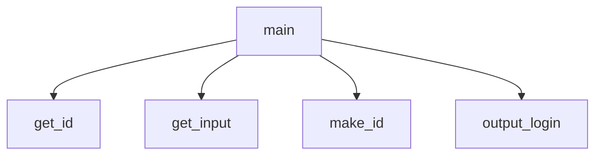

# User Login Generator
Damien Hays, Team member 2, Team member 3, etc..

## User Login Generator Description
Welcome to the user login generator.  It takes information from the user and uses that information to generate their system login username.

### User Login Generator Flowchart

#### Function Diagrams

| `main()`    |               |  Damien Hays     |
| ------------------ | ------------- | ------------ |
| `accepts no agruments`    | main accepts no arguments  |              |
|      | it calls get_id, make_id, and output_login  | returns nothing             |
***
| `get__input`    |               |     Damien Hays   |
| ------------------ | ------------- | ------------ |
| `accepts no arguments`    | prompts the user for  |              |
|      | first name, last name, and id number  |             |
|       |  | returns first_name, last_name, id_number |
***
| `make_id`    |               |     Damien Hays   |
| ------------------ | ------------- | ------------ |
| `string:first_name`    | uses string concatenation in the order of  |              |
| `string:last_name`     | last name, first name, and id number  |             |
| `string:id_number`      | to create the new user login | returns new_login |
***
| `output_login`    |               |     Damien Hays   |
| ------------------ | ------------- | ------------ |
| `string:new_login`    | outputs a message to the user  |              |
|      | with the single string for new_login  |             |
|       | to provide the user with their login | returns nothing |
***
