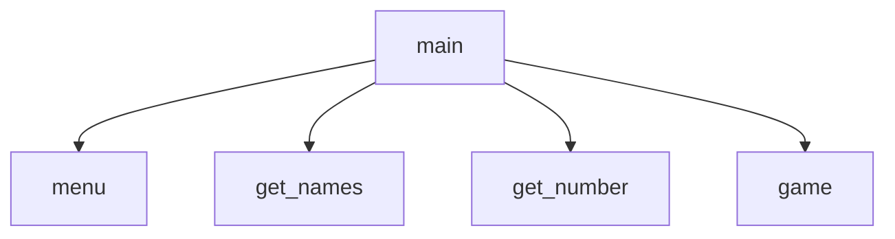

# Number Guessing Game
Sam Winchester, Dean Winchester

## Number Guessing Game Description
This program plays a game to guess numbers from 1 to 1000 or between numbers specified by the players.  It prompts each player for their first name
and if they would like to specify their own min/max for guesses.  When the game is over it outputs a message with the winner and the number of guesses it took.  This program was written as a team assignment by Sam and Dean Winchester.

### Number Guessing Game Flowchart

#### Function Diagrams

| `main`    |               |  Sam     |
| ------------------ | ------------- | ------------ |
| `no arguments`   | accepts no arguments  |              |
|       | it calls menu and processes through get_names, get_number, and game  | outputs a complete message at the end             |
|       | depending on the choice.  If the user specifies a new min/max, it should generate those random numbers | returns nothing |
***
| `menu`    |               |     Dean   |
| ------------------ | ------------- | ------------ |
| `no arguments`   | menu accepts no arguments, it prompts the user to choose between  |              |
|      | playing the game with the min/max of 1-1000  | outputs a menu of choices             |
|       | or to specify their own min/max | returns choice |
***
| `get_names`    |               |     Dean   |
| ------------------ | ------------- | ------------ |
| `no arguments`    | get_names accepts no arguments  |              |
|      | it prompts players 1 and 2 for their usernames  | outputs a prompt for input             |
|       |  | returns player1, player2 |
***
| `get_number`    |               |     Dean   |
| ------------------ | ------------- | ------------ |
| `integer:min`    | get_number accepts integers for min and max  |              |
| `integer:max`    | it generates the random integer to guess using min and max  | outputs nothing             |
|       | and returns the random integer | returns num |
***
| `game`    |               |     Sam   |
| ------------------ | ------------- | ------------ |
| `string:player1`    | game accepts strings for player1 and player2 and an integer for num  |              |
| `string:player2`    | it plays the game, taking turns and keeping track of the total number of guesses for each player  | outputs feedback for each guess       |
| `integer:num`      | when the number is guessed it outputs the winner and number of guesses it took to win | returns nothing |
***
